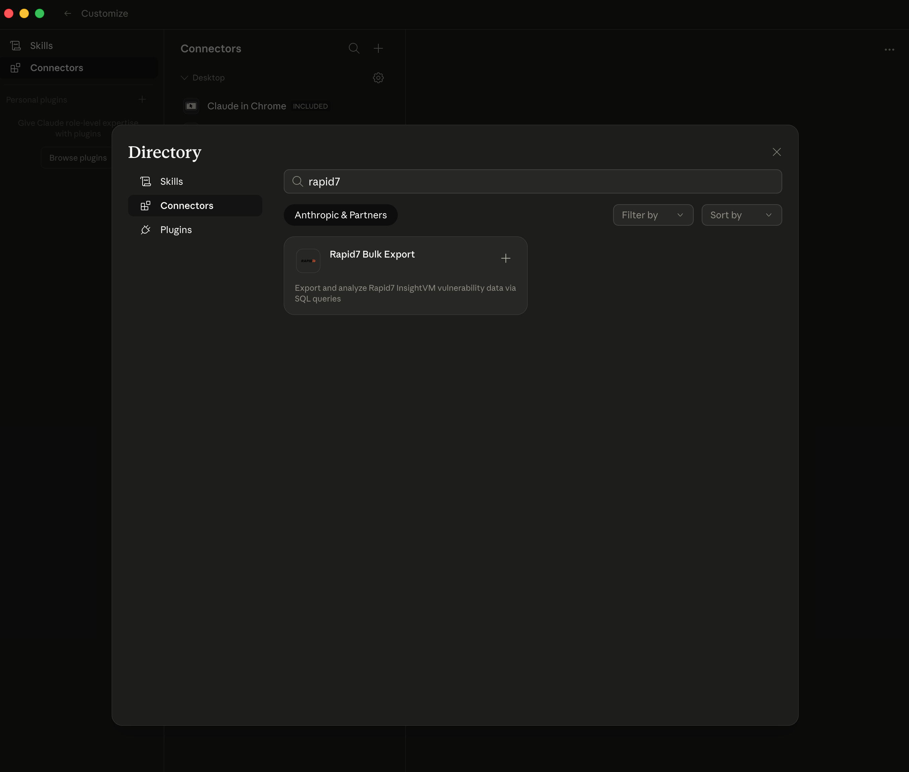
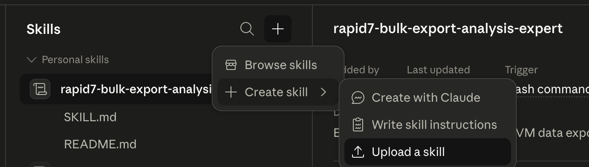
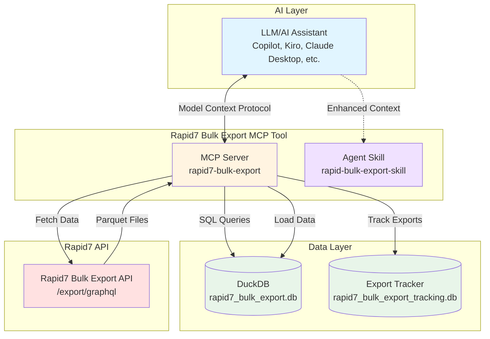

# Rapid7 Bulk Export MCP

AI-powered analysis for Rapid7 Command Platform data using MCP ([Model Context Protocol](https://modelcontextprotocol.io/docs/getting-started/intro)) & [AgentSkills](https://agentskills.io/home).

This tool is a best effort support, due to the bespoke and ever-changing nature of tools and workflows which would utilize this tool we cannot provide support or guidance outside of the MCP Code & AgentSkill Content.

## What is This?

This tool exports data from Rapid7 Command Platform, via the [Rapid7 Bulk Export API](https://docs.rapid7.com/insightvm/bulk-export-api/) and makes it queryable in GenAI and Agentic workflows.

- **MCP Server**: Embeds tools which allow the getting, processing and querying of data
- **Agent Skill**: Gives additional context, schema knowledge and instructions on how to use the MCP tools
- **DuckDB Database**: Local file-based database to allow structured rapid querying

## Features

- **AI-Powered Analysis**: Use with Kiro, Claude Desktop, or any MCP-compatible AI assistant
- **On-Demand Data Loading**: Automatically fetch and load data from Rapid7
- **Export Reuse**: Automatically reuses exports from the same day to avoid redundant API calls
- **Natural Language Queries**: Ask questions in plain English
- **SQL Query Execution**: Run complex SQL queries against vulnerability, asset and other data
- **Schema Exploration**: Discover available data fields
- **Statistics & Insights**: Get instant summaries and distributions
- **Security Lockdown**: User queries are sandboxed — filesystem and network access disabled at the DuckDB engine level
- **Docker Support**: Run as a containerized HTTP service for remote or shared deployments

## Local vs Remote

You can run the MCP server in two modes depending on your setup:

**Local (stdio)** — The AI client spawns the server as a child process and communicates over stdin/stdout. This is the default and simplest option. The server runs on your machine, the database lives next to it, and everything stays local. Best for individual use on a workstation or laptop.

**Remote (Docker / streamable HTTP)** — The server runs as a containerized HTTP service exposing a single `/mcp` endpoint. Clients connect over the network via URL. Best for shared environments, team use, or when you want the server running on dedicated infrastructure separate from your AI tool. It should be noted that this will make data shareable between all users of the remote mcp, you should authenticate and secure the /mcp endpoint.

Both modes use the same MCP tools and security controls. The only difference is how the client connects.

## Quick Start

### 0. Get Your Rapid7 API Key and Region

Before you begin, you'll need credentials from your Rapid7 Insight Platform account.

**Generate an API Key:**

> **Important:** The API key must be generated by a **Platform Admin**. The bulk export API returns all vulnerability data across the entire platform, so admin-level access is required.

1. Log in to the [Rapid7 Insight Platform](https://insight.rapid7.com) as a Platform Admin
2. Navigate to Administration → API Key Management
3. Choose the key type:
   - **Organization Key** (recommended): Full admin permissions (requires Platform Admin role)
   - **User Key**: Inherits your account permissions — must be created by a Platform Admin to have sufficient access for bulk exports
4. Click "Generate New Admin Key" (or "Generate New User Key" if using a Platform Admin account)
5. Select your organization and provide a name for the key
6. Copy the key immediately - you won't be able to view it again!

**Find Your Region:**

Your region determines which API endpoint to use. To find your region:

1. Go to [insight.rapid7.com](https://insight.rapid7.com) and sign in
2. Look for the "Data Storage Region" tag in the upper right corner below your account name

For more details, see:
- [Managing Platform API Keys](https://docs.rapid7.com/insight/managing-platform-api-keys)
- [Product APIs and Regions](https://docs.rapid7.com/insight/product-apis)

### 1. Set Up Your AI Tool

Choose your AI tool below. Each guide walks through installing the MCP server, adding the Agent Skill, and verifying the connection.

<details>
<summary><b>Claude Desktop</b></summary>

#### Install the MCP Server

0. Open Claude Desktop and navigate to Customize → Connectors
0. Search for "Rapid7 Bulk Export" in the connectors directory
0. Click Install and provide your `RAPID7_API_KEY` and `RAPID7_REGION` when prompted



#### Install the Agent Skill

0. Go to Customize -> Skills
0. Click the (+)
0. Create Skill
0. Upload Skill
0. Upload the latest skill zipfile from the release on the right



#### Verify

1. Try: `/rapid7-bulk-export-analysis-expert Load the latest vulnerability data from Rapid7`

</details>

<details>
<summary><b>AWS Kiro</b></summary>

#### Install the MCP Server

```bash
# Using uv
uv pip install git+https://github.com/rapid7/rapid7-bulk-export-mcp.git

# Or using pip
pip install git+https://github.com/rapid7/rapid7-bulk-export-mcp.git
```

#### Configure

Create or edit `.kiro/settings/mcp.json`:

```json
{
  "mcpServers": {
    "rapid7-bulk-export": {
      "command": "rapid7-mcp-server",
      "args": [],
      "env": {
        "RAPID7_API_KEY": "your-api-key-here",
        "RAPID7_REGION": "us"
      }
    }
  }
}
```

#### Install the Agent Skill

1. Open the Kiro Skills panel (Command Palette → "Kiro: Open Skills")
2. Click "Install from GitHub"
3. Enter the repository URL: `https://github.com/rapid7/rapid7-bulk-export-mcp/rapid7-bulk-export-skill`

Activate the skill in chat with `#rapid7-bulk-export-skill`.

#### Verify

1. Restart or reconnect MCP servers (Command Palette → "MCP: Reconnect All Servers")
2. Check MCP panel for "rapid7-bulk-export" server (should show "Connected")
3. Try: `#rapid7-bulk-export-skill Load the latest vulnerability data from Rapid7`

</details>

<details>
<summary><b>Claude Code (IDE)</b></summary>

#### Install the MCP Server

```bash
# Using uv
uv pip install git+https://github.com/rapid7/rapid7-bulk-export-mcp.git

# Or using pip
pip install git+https://github.com/rapid7/rapid7-bulk-export-mcp.git
```

#### Configure

Use the Claude Code CLI:

```bash
claude mcp add --transport stdio \
  --env RAPID7_API_KEY=your-api-key-here \
  --env RAPID7_REGION=us \
  rapid7-bulk-export \
  -- rapid7-mcp-server
```

Or manually edit `~/.claude.json` (user scope) or `.mcp.json` (project scope):

```json
{
  "mcpServers": {
    "rapid7-bulk-export": {
      "command": "rapid7-mcp-server",
      "args": [],
      "env": {
        "RAPID7_API_KEY": "your-api-key-here",
        "RAPID7_REGION": "us"
      }
    }
  }
}
```

Use `--scope user` for cross-project access or `--scope project` for team sharing.

#### Install the Agent Skill

```bash
# User-level (available in all projects)
mkdir -p ~/.claude/skills/rapid7-bulk-export
curl -sL https://raw.githubusercontent.com/rapid7/rapid7-bulk-export-mcp/main/rapid7-bulk-export-skill/SKILL.md \
  -o ~/.claude/skills/rapid7-bulk-export/SKILL.md

# Or project-level (only in current project)
mkdir -p .claude/skills/rapid7-bulk-export
curl -sL https://raw.githubusercontent.com/rapid7/rapid7-bulk-export-mcp/main/rapid7-bulk-export-skill/SKILL.md \
  -o .claude/skills/rapid7-bulk-export/SKILL.md
```

Or use `npx skills` to install directly:

```bash
npx skills install https://github.com/rapid7/rapid7-bulk-export-mcp
```

Claude Code will automatically discover and use the skill when relevant.

#### Verify

1. Restart Claude Code or reload the window
2. Type `/mcp` in chat to check server status
3. Verify "rapid7-bulk-export" appears in the list
4. Try: `Load the latest vulnerability data from Rapid7`

</details>

<details>
<summary><b>GitHub Copilot (VS Code)</b></summary>

#### Install the MCP Server

```bash
# Using uv
uv pip install git+https://github.com/rapid7/rapid7-bulk-export-mcp.git

# Or using pip
pip install git+https://github.com/rapid7/rapid7-bulk-export-mcp.git
```

#### Configure

Edit MCP settings in VS Code:
- Use Command Palette: "MCP: Edit Configuration"
- Or manually edit: `.vscode/mcp.json` (workspace) or user settings

```json
{
  "mcpServers": {
    "rapid7-bulk-export": {
      "command": "rapid7-mcp-server",
      "args": [],
      "env": {
        "RAPID7_API_KEY": "your-api-key-here",
        "RAPID7_REGION": "us"
      }
    }
  }
}
```

#### Install the Agent Skill

```bash
# Project-level (recommended, stored in repository)
mkdir -p .github/skills/rapid7-bulk-export
curl -sL https://raw.githubusercontent.com/rapid7/rapid7-bulk-export-mcp/main/rapid7-bulk-export-skill/SKILL.md \
  -o .github/skills/rapid7-bulk-export/SKILL.md

# Or user-level (available across all projects)
mkdir -p ~/.copilot/skills/rapid7-bulk-export
curl -sL https://raw.githubusercontent.com/rapid7/rapid7-bulk-export-mcp/main/rapid7-bulk-export-skill/SKILL.md \
  -o ~/.copilot/skills/rapid7-bulk-export/SKILL.md
```

Or use `npx skills` to install directly:

```bash
npx skills install https://github.com/rapid7/rapid7-bulk-export-mcp
```

Use the skill as a slash command: `/rapid7-bulk-export`.

#### Verify

1. Reload VS Code window
2. Check MCP status in the status bar or output panel
3. Try: `Load the latest vulnerability data from Rapid7`

</details>

<details>
<summary><b>Docker (remote / shared deployments)</b></summary>

#### Build and Run

```bash
# Build
docker build -t rapid7-bulk-export-mcp .

# Run
docker run -d \
  -p 8000:8000 \
  -e RAPID7_API_KEY=your-api-key-here \
  -e RAPID7_REGION=us \
  --name rapid7-bulk-export-mcp \
  rapid7-bulk-export-mcp
```

Or with docker compose:

```bash
RAPID7_API_KEY=your-key RAPID7_REGION=us docker compose up -d
```

#### Configure Your MCP Client

Point any MCP-compatible client at the HTTP endpoint:

```json
{
  "mcpServers": {
    "rapid7-bulk-export": {
      "url": "http://localhost:8000/mcp"
    }
  }
}
```

#### Install the Agent Skill

Follow the skill installation for your specific AI tool above. The skill works the same regardless of whether the MCP server is local or remote.

#### Verify

1. Confirm the container is running: `docker ps`
2. Test the endpoint: `curl http://localhost:8000/mcp`
3. Connect your AI tool and try: `Load the latest vulnerability data from Rapid7`

</details>

### 2. Start Analyzing

> **Note:** The first export takes 1-5 minutes depending on org size. Once complete, the data is cached and subsequent loads reuse the same export. You can always ask to refresh the data to get the latest set.

```
Show me the top 10 critical vulnerabilities with known exploits
```

```
What's the severity distribution across my cloud assets?
```

## Tool Reference

### `start_rapid7_export`

Kicks off a new export job on Rapid7's servers. Returns immediately with an export ID. Supports three export types: `vulnerability`, `policy`, and `remediation`.

```
Start a vulnerability export from Rapid7
```

### `check_rapid7_export_status`

Polls the Rapid7 API once for the current status of an export job. Use after `start_rapid7_export` to know when data is ready.

```
Check the status of export abc-123
```

### `download_rapid7_export`

Downloads a completed export's Parquet files and loads them into the local DuckDB database. This is where data becomes queryable.

```
Download and load export abc-123
```

### `load_rapid7_parquet`

Loads existing Parquet files directly from disk (must be within `~/.rapid7-mcp/imports/`). Useful if you already have exported files and want to skip the API call.

```
Load parquet files from ~/.rapid7-mcp/imports/my-export/
```

### `query_rapid7`

Executes SQL against the loaded data. The connection is locked down after loading — filesystem reads, writes, and network access are all blocked at the DuckDB engine level.

Available tables: `assets`, `vulnerabilities`, `policies`, `vulnerability_remediation`.

```
Run: SELECT severity, COUNT(*) FROM vulnerabilities GROUP BY severity
```

### `get_rapid7_schema`

Returns column names and data types for all loaded tables. Use this to understand what fields are available before writing queries.

```
Show me the schema of the loaded data
```

### `get_rapid7_stats`

Returns summary statistics — row counts, severity distributions, CVSS score ranges, exploit counts, and cloud provider breakdowns.

```
Give me an overview of the vulnerability data
```

### `list_rapid7_exports`

Shows recent export history with IDs, dates, statuses, and row counts. Useful for finding a previous export to reload.

```
List my recent exports
```

### `purge_rapid7_data`

Permanently deletes both the vulnerability database and the export tracking database from disk. Use when you're done with analysis or before handing off a machine.

```
Purge all local Rapid7 data
```

## Architecture



## Development

Changes to the AgentSkill and MCP can be done locally to allow you to tailor to your environment — contributions are welcome back to this repository.

### Clone and Install

```bash
git clone https://github.com/rapid7/rapid7-bulk-export-mcp.git
cd rapid7-bulk-export-mcp
uv sync
```

### Configure for Development

Create or edit `.kiro/settings/mcp.json`:

```json
{
  "mcpServers": {
    "rapid7-bulk-export": {
      "command": "uv",
      "args": ["run", "rapid7-mcp-server"],
      "cwd": "/absolute/path/to/rapid7-bulk-export-mcp",
      "env": {
        "RAPID7_API_KEY": "your-api-key-here",
        "RAPID7_REGION": "us"
      }
    }
  }
}
```

### Run Tests

```bash
uv run pytest
```

### Environment Variables

| Variable | Required | Default | Description |
|----------|----------|---------|-------------|
| `RAPID7_API_KEY` | Yes | — | Rapid7 InsightVM API key |
| `RAPID7_REGION` | Yes | `us` | API region: `us`, `us2`, `us3`, `eu`, `ca`, `au`, `ap` |
| `MCP_TRANSPORT` | No | `stdio` | Transport protocol: `stdio` or `http` |
| `MCP_HOST` | No | `0.0.0.0` | HTTP bind address (only when `MCP_TRANSPORT=http`) |
| `MCP_PORT` | No | `8000` | HTTP port (only when `MCP_TRANSPORT=http`) |
