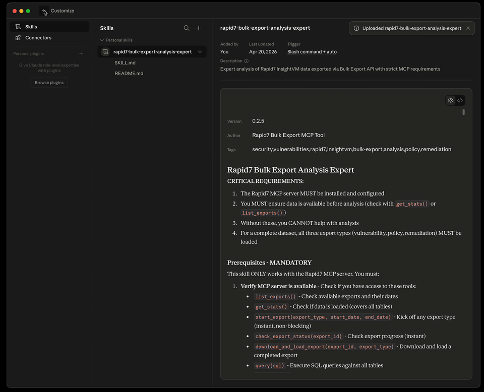
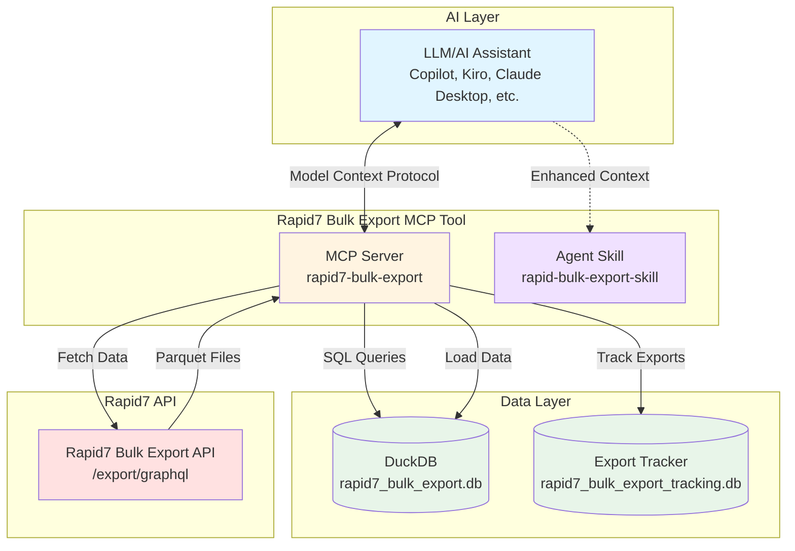

# Rapid7 Bulk Export MCP

AI-powered analysis for Rapid7 Command Platform data using MCP ([Model Context Protocol](https://modelcontextprotocol.io/docs/getting-started/intro)) & [AgentSkills](https://agentskills.io/home).

This tool is a best effort support, due to the bespoke and ever-changing nature of tools and workflows which would utilize this tool we cannot provide support or guidance outside of the MCP Code & AgentSkill Content.

## What is This?

This tool exports data from Rapid7 Command Platform, via the [Rapid7 Bulk Export API](https://docs.rapid7.com/insightvm/bulk-export-api/) and makes it queryable in GenAI and Agentic workflows.

- **MCP Server**: Embeds tools which allow the getting, processing and querying of data
- **Agent Skill**: Gives additional context, schema knowledge and instructions on how to use the MCP tools
- **DuckDB Database**: Local file-based database to allow structured rapid querying

## Demo


## Quickstart for Claude Desktop

Download the mcpb and zip from the Github Releases on the right hand side. For other AI Tools and more detailed instructions see the getting started guide further down.

### Install


### Initialize Data

This is done once a day and takes 1-5mins depending on the size of your org.



## Features

- **AI-Powered Analysis**: Use with Kiro, Claude Desktop, or any MCP-compatible AI assistant
- **On-Demand Data Loading**: Automatically fetch and load data from Rapid7 via `export_and_load` tool
- **Export Reuse**: Automatically reuses exports from the same day to avoid redundant API calls
- **Natural Language Queries**: Ask questions in plain English
- **SQL Query Execution**: Run complex SQL queries against vulnerability, asset and other data
- **Schema Exploration**: Discover available data fields
- **Statistics & Insights**: Get instant summaries and distributions

## MCP Server Tools

- `export_and_load()` - **Call first**: Fetch and load data from Rapid7 (reuses today's export if available)
- `list_exports(limit)` - View recent exports and their metadata
- `query_vulnerabilities(sql)` - Execute SQL queries
- `get_schema()` - View table schema
- `get_stats()` - Get summary statistics
- `suggest_query(task)` - Get query suggestions

## Quick Start

### 0. Get Your Rapid7 API Key and Region

Before you begin, you'll need credentials from your Rapid7 Insight Platform account.

**Generate an API Key:**

1. Log in to the [Rapid7 Insight Platform](https://insight.rapid7.com)
2. Navigate to Administration → API Key Management
3. Choose the key type:
   - **User Key**: Inherits your account permissions (any user can create)
   - **Organization Key**: Full admin permissions (requires Platform Admin role)
4. Click "Generate New User Key" (or "Generate New Admin Key" for org keys)
5. Select your organization and provide a name for the key
6. Copy the key immediately - you won't be able to view it again!

**Find Your Region:**

Your region determines which API endpoint to use. To find your region:

1. Go to [insight.rapid7.com](https://insight.rapid7.com) and sign in
2. Look for the "Data Storage Region" tag in the upper right corner below your account name

For more details, see:
- [Managing Platform API Keys](https://docs.rapid7.com/insight/managing-platform-api-keys)
- [Product APIs and Regions](https://docs.rapid7.com/insight/product-apis)

### 1. Install

```bash
# Using pip
pip install git+https://github.com/rapid7/rapid7-bulk-export-mcp.git

# Or using uv
uv pip install git+https://github.com/rapid7/rapid7-bulk-export-mcp.git
```

### 2. Configure MCP Server

The configuration format and location varies by AI assistant. Below are some examples for popular tools:

<details>
<summary><b>AWS Kiro</b></summary>

Create or edit `.kiro/settings/mcp.json`:

```json
{
  "mcpServers": {
    "rapid7-bulk-export": {
      "command": "rapid7-mcp-server",
      "args": [],
      "env": {
        "RAPID7_API_KEY": "your-api-key-here",
        "RAPID7_REGION": "us"
      }
    }
  }
}
```

**Configuration Notes:**
- `RAPID7_API_KEY` - Required: Your Rapid7 InsightVM API key
- `RAPID7_REGION` - Required: Your region (`us`, `eu`, `ca`, `au`, or `ap`)

</details>

<details>
<summary><b>Claude Code (IDE)</b></summary>

Use the Claude Code CLI to add the MCP server:

```bash
claude mcp add --transport stdio \
  --env RAPID7_API_KEY=your-api-key-here \
  --env RAPID7_REGION=us \
  rapid7-bulk-export \
  -- rapid7-mcp-server
```

Or manually edit `~/.claude.json` (user scope) or `.mcp.json` (project scope):

```json
{
  "mcpServers": {
    "rapid7-bulk-export": {
      "command": "rapid7-mcp-server",
      "args": [],
      "env": {
        "RAPID7_API_KEY": "your-api-key-here",
        "RAPID7_REGION": "us"
      }
    }
  }
}
```

**Configuration Notes:**
- `RAPID7_API_KEY` - Required: Your Rapid7 InsightVM API key
- `RAPID7_REGION` - Required: Your region (`us`, `eu`, `ca`, `au`, or `ap`)
- Use `--scope user` for cross-project access or `--scope project` for team sharing

</details>

<details>
<summary><b>Claude Desktop</b></summary>

Edit `claude_desktop_config.json`:
- macOS: `~/Library/Application Support/Claude/claude_desktop_config.json`
- Windows: `%APPDATA%\Claude\claude_desktop_config.json`

```json
{
  "mcpServers": {
    "rapid7-bulk-export": {
      "command": "rapid7-mcp-server",
      "args": [],
      "env": {
        "RAPID7_API_KEY": "your-api-key-here",
        "RAPID7_REGION": "us"
      }
    }
  }
}
```

**Configuration Notes:**
- `RAPID7_API_KEY` - Required: Your Rapid7 InsightVM API key
- `RAPID7_REGION` - Required: Your region (`us`, `eu`, `ca`, `au`, or `ap`)

</details>

<details>
<summary><b>GitHub Copilot (VS Code)</b></summary>

Edit MCP settings in VS Code:
- Use Command Palette: "MCP: Edit Configuration"
- Or manually edit: `.vscode/mcp.json` (workspace) or user settings

```json
{
  "mcpServers": {
    "rapid7-bulk-export": {
      "command": "rapid7-mcp-server",
      "args": [],
      "env": {
        "RAPID7_API_KEY": "your-api-key-here",
        "RAPID7_REGION": "us"
      }
    }
  }
}
```

**Configuration Notes:**
- `RAPID7_API_KEY` - Required: Your Rapid7 InsightVM API key
- `RAPID7_REGION` - Required: Your region (`us`, `eu`, `ca`, `au`, or `ap`)

</details>


### 3. Install Agent Skill

The Agent Skill provides domain expertise for vulnerability analysis.

**What the Skill Provides:**
- Understanding of bulk export data schema
- SQL query patterns and examples
- Best practices for security analysis
- Guidance on risk prioritization

<details>
<summary><b>Kiro</b></summary>

```bash
# User-level (available in all workspaces)
cp rapid7-bulk-export-skill/SKILL.md ~/.kiro/skills/rapid7-bulk-export.md

# Or workspace-level (only in current workspace)
cp rapid7-bulk-export-skill/SKILL.md .kiro/skills/rapid7-bulk-export.md
```

Activate the skill in chat:
```
#rapid7-bulk-export
```

</details>

<details>
<summary><b>Claude Code (IDE)</b></summary>

```bash
# User-level (available in all projects)
mkdir -p ~/.claude/skills/rapid7-bulk-export
cp rapid7-bulk-export-skill/SKILL.md ~/.claude/skills/rapid7-bulk-export/

# Or project-level (only in current project)
mkdir -p .claude/skills/rapid7-bulk-export
cp rapid7-bulk-export-skill/SKILL.md .claude/skills/rapid7-bulk-export/
```

Claude Code will automatically discover and use the skill when relevant.

</details>

<details>
<summary><b>GitHub Copilot (VS Code)</b></summary>

```bash
# Project-level (recommended, stored in repository)
mkdir -p .github/skills/rapid7-bulk-export
cp rapid7-bulk-export-skill/SKILL.md .github/skills/rapid7-bulk-export/

# Or user-level (available across all projects)
mkdir -p ~/.copilot/skills/rapid7-bulk-export
cp rapid7-bulk-export-skill/SKILL.md ~/.copilot/skills/rapid7-bulk-export/
```

Use the skill as a slash command in chat:
```
/rapid7-bulk-export
```

GitHub Copilot will also automatically load the skill when relevant to your request.

</details>

<details>
<summary><b>Other AI Assistants</b></summary>

For Claude Desktop and other AI assistants, you can manually include the skill content in your prompts or conversations as needed.

</details>

**Note:** The skill provides knowledge and guidance. The MCP server (configured in step 2) executes the actual queries.

### 4. Verify Installation

<details>
<summary><b>Kiro</b></summary>

1. Restart or reconnect MCP servers (Command Palette → "MCP: Reconnect All Servers")
2. Check MCP panel for "rapid7-bulk-export" server (should show "Connected")

</details>

<details>
<summary><b>Claude Code (IDE)</b></summary>

1. Restart Claude Code or reload the window
2. Type `/mcp` in chat to check server status
3. Verify "rapid7-bulk-export" appears in the list

</details>

<details>
<summary><b>Claude Desktop</b></summary>

1. Restart Claude Desktop
2. Look for the MCP server icon in the chat interface

</details>

<details>
<summary><b>GitHub Copilot (VS Code)</b></summary>

1. Reload VS Code window
2. Check MCP status in the status bar or output panel

</details>

Try a query:
```
Load the latest vulnerability data from Rapid7
```

**Note:** The first export can take 5+ minutes. Once complete, the data is cached and subsequent loads reuse the same export (if run on the same day).

### 5. Start Analyzing

```
Show me the top 10 critical vulnerabilities
```

Or:

```
What's the severity distribution of my vulnerabilities?
```


## Architecture




## Development Quick Start

Changes to the AgentSkill and MCP can be done locally to allow you to tailor to your envrionment - contributions are welcome back to this repository.

### 1. Clone and Install

```bash
# Clone the repository
git clone https://github.com/rapid7/rapid7-bulk-export-mcp.git
cd rapid7-bulk-export-mcp

# Install dependencies
uv sync

# Or using pip
pip install -e .
```

### 2. Configure MCP Server for Development

Create or edit `.kiro/settings/mcp.json`:

**Option A: Using uv (recommended)**

```json
{
  "mcpServers": {
    "rapid7-bulk-export": {
      "command": "uv",
      "args": ["run", "rapid7-mcp-server"],
      "cwd": "/absolute/path/to/rapid7-bulk-export-mcp",
      "env": {
        "RAPID7_API_KEY": "your-api-key-here",
        "RAPID7_REGION": "us"
      }
    }
  }
}
```

**Option B: Using Python directly**

```json
{
  "mcpServers": {
    "rapid7-bulk-export": {
      "command": "python",
      "args": ["-m", "src.mcp_server"],
      "cwd": "/absolute/path/to/rapid7-bulk-export-mcp",
      "env": {
        "RAPID7_API_KEY": "your-api-key-here",
        "RAPID7_REGION": "us"
      }
    }
  }
}
```