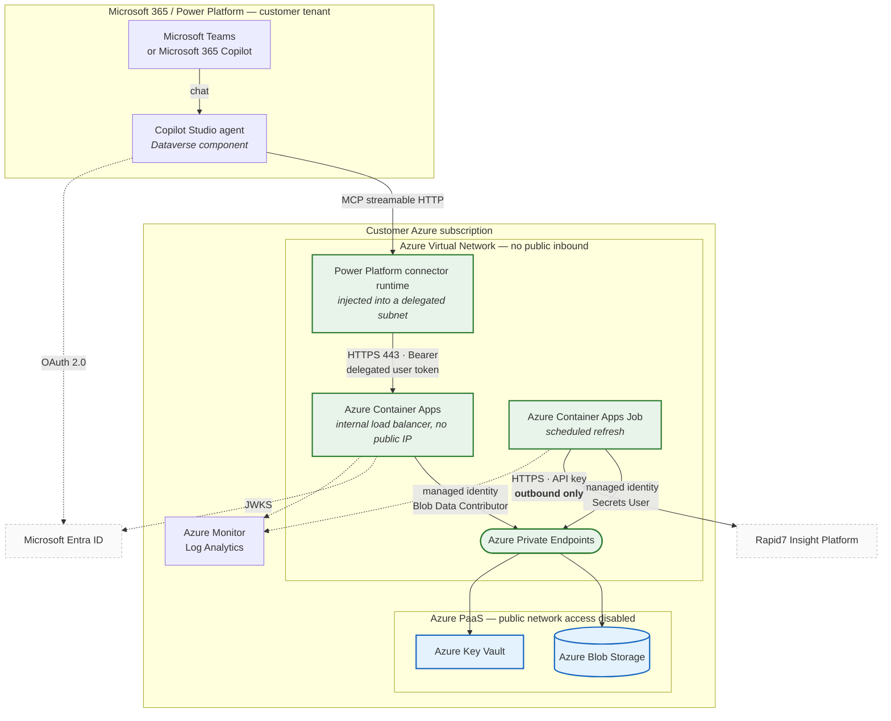

# Architecture diagram

Service-to-service view of the deployed topology. Every edge names its protocol and
how it authenticates. Dotted edges are identity and telemetry; solid edges carry data.

Mermaid source, so it renders in GitHub, Teams, Confluence and most slide tools.

See [`copilot-studio-hosting.md`](copilot-studio-hosting.md) for how it works, and
[`../deploy/azure/SETUP.md`](../deploy/azure/SETUP.md) for how to build it.

Everything inside the outer box runs in the customer's **own Azure subscription**.
Only Microsoft Entra ID and the Rapid7 platform sit outside it, and both are reached
outbound.

## Notes a reviewer will want

**The connector runtime is inside the customer's network.** That is the whole basis of
the design — Power Platform VNet support injects it into a delegated subnet, so its
call to the Container App never traverses the internet. Confirmed by the server
logging an inbound request from that subnet.

**No secrets on any edge except one.** Both Azure workloads authenticate to Blob and
Key Vault with a user-assigned managed identity holding narrowly-scoped roles. The
only long-lived credential is the Rapid7 API key, held in Key Vault and read solely by
the refresh job — the serving container has no Rapid7 credential at all.

**The user's identity reaches the server.** The connector sends a delegated user
token, not an application token. There is no per-user data filtering, so that token is
the only record of who asked what.

**The two Entra edges are outbound and unavoidable.** The agent obtains a token and
the server fetches signing keys, both to public Microsoft endpoints. Neither carries
customer data and neither accepts inbound connections.

**The dataset is a point-in-time copy.** The refresh job publishes a complete snapshot
and the serving container opens a local read-only copy, so queries are never served
from a partially-loaded database. Answers state how old the data is.

**The connector runtime's region is assigned, not chosen.** If Power Platform places
the environment in a different Azure region from the Container Apps environment, the
delegated subnet lives in its own virtual network and needs peering *plus* a private
DNS zone link. Peering alone gives connectivity without name resolution — see the trap
in [`../deploy/azure/SETUP.md`](../deploy/azure/SETUP.md).

## What is deliberately absent

No Front Door, no WAF, no Application Gateway and no public origin. There is nothing
publicly addressable to protect, so adding those would be cost without a control.
